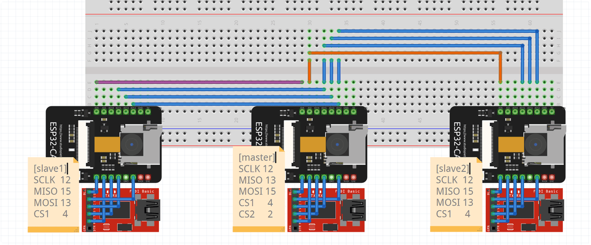

# esp32cam-lab




Three ESP32-CAM devices (A, B, C) to create a multi-camera system with centralized data collection and distribution.

## System Overview

- Device A (Master):

  - Captures QVGA grayscale camera feed
  - Acts as SPI master
  - Collects frames from devices B and C
  - Provides combined camera feeds over WiFi

- Devices B and C (Slaves):
  - Capture QQVGA grayscale camera feeds
  - Act as SPI slaves
  - Send frames to device A

## Key Features

- Efficient use of all ESP32-CAM cores
- SPI communication for inter-device data transfer
- WiFi streaming of combined camera feeds
- Independent channel provision for A, B, and C feeds

## Project Structure

### system_info

```
[ 11773][I][system_info.cpp:20] printSystemInfo(): [example:system_info] ESP32 Chip Information:
[ 11782][I][system_info.cpp:21] printSystemInfo(): [example:system_info] - Model: ESP32-D0WD-V3
[ 11793][I][system_info.cpp:22] printSystemInfo(): [example:system_info] - Cores: 2
[ 11802][I][system_info.cpp:24] printSystemInfo(): [example:system_info] - Features: WiFi/BT/BLE
[ 11813][I][system_info.cpp:25] printSystemInfo(): [example:system_info] - Silicon revision: 3
[ 11824][I][system_info.cpp:30] printSystemInfo(): [example:system_info] Flash Memory: 4MB external
[ 11835][I][system_info.cpp:33] printSystemInfo(): [example:system_info] CPU Frequency: 240MHz
[ 11846][I][system_info.cpp:36] printSystemInfo(): [example:system_info] SRAM Size: 365 KB
[ 11856][I][system_info.cpp:37] printSystemInfo(): [example:system_info] Available SRAM: 342 KB
[ 11866][I][system_info.cpp:43] printSystemInfo(): [example:system_info] MAC Address: 08:A6:F7:48:70:AC
[ 11878][E][system_info.cpp:70] printSystemInfo(): [example:system_info] Failed to get WiFi mode
[ 11889][I][system_info.cpp:77] printSystemInfo(): [example:system_info] Battery Voltage: 0.00V
[ 11899][I][system_info.cpp:80] printSystemInfo(): [example:system_info] System Uptime: 11 seconds
```

### basic_wifi_server

#### Story

1. Creates a WiFi Access Point (AP) with SSID "ESP32CAM-AP"
2. Hosts a simple web server showing system uptime
3. Auto-refreshes every second to show real-time updates

```
Access Point Started
IP Address: 192.168.4.1
HTTP server started
```

### basic_wifi_endpoint


#### Story

1. Connects to an existing WiFi network as a client
2. Hosts a status page showing WiFi details (SSID, IP, RSSI, MAC)
3. Auto-reconnects if connection is lost
4. Updates status every 5 seconds

```
Connecting to WiFi... (Attempt 1/10)
Connected to WiFi successfully!
IP Address: 192.168.1.184
Signal Strength (RSSI): -62 dBm
HTTP server started
```

### heavy_task_serial

```
[ 39164][I][heavy_task_serial.cpp:16] performHeavyTask(): [example:heavy_task_serial] Task1 completed. Result: 1783293664
[ 39225][I][heavy_task_serial.cpp:16] performHeavyTask(): [example:heavy_task_serial] Task2 completed. Result: 1783293664
[ 39236][I][heavy_task_serial.cpp:36] loop(): [example:heavy_task_serial] Total execution time: 122 ms
[ 39248][I][heavy_task_serial.cpp:37] loop(): [example:heavy_task_serial] --------------------
```

### heavy_task_parallel

```
[ 10230][I][heavy_task_parallel.cpp:23] performHeavyTa[s k1(0)2:3 0[]e[xIa]m[phleea:vhye_atvays_kt_apsakr_aplalreall.lceplp]: 2T3]sk2rcorpmetavyonscore [e Replet: 1avy2tas64parallel] Task1 completed on core 0. Result: 1783293664
[ 10255][I][heavy_task_parallel.cpp:57] loop(): [example:heavy_task_parallel] Total execution time: 76 ms
[ 10265][I][heavy_task_parallel.cpp:58] loop(): [example:heavy_task_parallel] --------------------
```

> notice mangled log by race condition

### heavy_task_parallel_mutex

```
Task2 completed on core 1. Result: 1783293664
Task1 completed on core 0. Result: 1783293664
Total execution time: 54 ms
--------------------
```

### math_fft_naive

```
[  6958][I][math_fft_naive.cpp:48] heavy_task(): [example:math_fft_naive] Power at frequency 0: 0.0605
[  6967][I][math_fft_naive.cpp:48] heavy_task(): [example:math_fft_naive] Power at frequency 1: 0.4898
[  6979][I][math_fft_naive.cpp:48] heavy_task(): [example:math_fft_naive] Power at frequency 2: 0.3238
[  6990][I][math_fft_naive.cpp:48] heavy_task(): [example:math_fft_naive] Power at frequency 3: 0.2472
[  7001][I][math_fft_naive.cpp:48] heavy_task(): [example:math_fft_naive] Power at frequency 4: 0.1167
[  7012][I][math_fft_naive.cpp:48] heavy_task(): [example:math_fft_naive] Power at frequency 5: 0.1268
[  7024][I][math_fft_naive.cpp:48] heavy_task(): [example:math_fft_naive] Power at frequency 6: 0.0734
[  7035][I][math_fft_naive.cpp:48] heavy_task(): [example:math_fft_naive] Power at frequency 7: 0.1736
[  7046][I][math_fft_naive.cpp:48] heavy_task(): [example:math_fft_naive] Power at frequency 8: 0.1471
[  7057][I][math_fft_naive.cpp:48] heavy_task(): [example:math_fft_naive] Power at frequency 9: 0.0386
[  7069][I][math_fft_naive.cpp:48] heavy_task(): [example:math_fft_naive] Power at frequency 10: 4064.5164
[  7080][I][math_fft_naive.cpp:48] heavy_task(): [example:math_fft_naive] Power at frequency 11: 0.0411
[  7092][I][math_fft_naive.cpp:48] heavy_task(): [example:math_fft_naive] Power at frequency 12: 0.0722
[  7103][I][math_fft_naive.cpp:48] heavy_task(): [example:math_fft_naive] Power at frequency 13: 0.0146
[  7114][I][math_fft_naive.cpp:48] heavy_task(): [example:math_fft_naive] Power at frequency 14: 0.2591
[  7126][I][math_fft_naive.cpp:48] heavy_task(): [example:math_fft_naive] Power at frequency 15: 0.5501
[  7137][I][math_fft_naive.cpp:51] heavy_task(): [example:math_fft_naive] Time taken: 1629 milliseconds
```

### math_fft_dsp

```
[  4888][I][math_fft_dsp.cpp:48] heavy_task(): [example:math_fft_dsp] Power at frequency 0: 0.0605
[  4897][I][math_fft_dsp.cpp:48] heavy_task(): [example:math_fft_dsp] Power at frequency 1: 1.9593
[  4908][I][math_fft_dsp.cpp:48] heavy_task(): [example:math_fft_dsp] Power at frequency 2: 1.2951
[  4919][I][math_fft_dsp.cpp:48] heavy_task(): [example:math_fft_dsp] Power at frequency 3: 0.9889
[  4930][I][math_fft_dsp.cpp:48] heavy_task(): [example:math_fft_dsp] Power at frequency 4: 0.4669
[  4940][I][math_fft_dsp.cpp:48] heavy_task(): [example:math_fft_dsp] Power at frequency 5: 0.5072
[  4951][I][math_fft_dsp.cpp:48] heavy_task(): [example:math_fft_dsp] Power at frequency 6: 0.2935
[  4962][I][math_fft_dsp.cpp:48] heavy_task(): [example:math_fft_dsp] Power at frequency 7: 0.6943
[  4973][I][math_fft_dsp.cpp:48] heavy_task(): [example:math_fft_dsp] Power at frequency 8: 0.5883
[  4984][I][math_fft_dsp.cpp:48] heavy_task(): [example:math_fft_dsp] Power at frequency 9: 0.1544
[  4995][I][math_fft_dsp.cpp:48] heavy_task(): [example:math_fft_dsp] Power at frequency 10: 16258.0693
[  5006][I][math_fft_dsp.cpp:48] heavy_task(): [example:math_fft_dsp] Power at frequency 11: 0.1645
[  5017][I][math_fft_dsp.cpp:48] heavy_task(): [example:math_fft_dsp] Power at frequency 12: 0.2890
[  5028][I][math_fft_dsp.cpp:48] heavy_task(): [example:math_fft_dsp] Power at frequency 13: 0.0584
[  5039][I][math_fft_dsp.cpp:48] heavy_task(): [example:math_fft_dsp] Power at frequency 14: 1.0364
[  5050][I][math_fft_dsp.cpp:48] heavy_task(): [example:math_fft_dsp] Power at frequency 15: 2.2005
[  5061][I][math_fft_dsp.cpp:51] heavy_task(): [example:math_fft_dsp] Time taken: 0.1860 milliseconds
```

> 1000x faster? the number is highly suspicious..

### math_dotprod_naive

```
[  3536][I][math_dotprod_naive.cpp:45] heavy_task(): [example:heavy_task_parallel] Dot product result = 260.929718
[  3546][I][math_dotprod_naive.cpp:46] heavy_task(): [example:heavy_task_parallel] Operation took 13468 cycles
[  3558][I][math_dotprod_naive.cpp:47] heavy_task(): [example:heavy_task_parallel] Operation took 56 microseconds
```

### math_dotprod_dsp

```
[  3540][I][math_dotprod_dsp.cpp:44] heavy_task(): [example:heavy_task_parallel] Dot product result = 255.693115
[  3550][I][math_dotprod_dsp.cpp:45] heavy_task(): [example:heavy_task_parallel] Operation took 4253 cycles
[  3562][I][math_dotprod_dsp.cpp:46] heavy_task(): [example:heavy_task_parallel] Operation took 17 microseconds
```

### camera_throughput

PIXFORMAT_JPEG, FRAMESIZE_QQVGA
Throughput: 50.00 FPS, Avg size of last 5 images: 3065.00 bytes

PIXFORMAT_JPEG, FRAMESIZE_QVGA
Throughput: 50.00 FPS, Avg size of last 5 images: 3065.00 bytes

PIXFORMAT_GRAYSCALE

### converter_throughput

QQVGA gray to rgb
Current FPS: 177.62

QQVGA gray to jpeg:

```
Current FPS: 101.14, JPEG size: 2481 bytes
Free heap: 337496 bytes
Largest free block: 3997684 bytes
Free PSRAM: 4041819 bytes
```

QVGA gray to jpeg:

```
Current FPS: 25.36, JPEG size: 7345 bytes
Free heap: 337496 bytes
Largest free block: 3932148 bytes
Free PSRAM: 3984219 bytes
```

### spi_hello1

#### Story

1. Master sends characters over SPI
2. Slave receives and prints them

master:

```
[  8609][I][spi_hello1_master.cpp:68] loop(): [example:spi_hello1_master] Transmitted: yo
[  9617][I][spi_hello1_master.cpp:68] loop(): [example:spi_hello1_master] Transmitted: yo
[ 10625][I][spi_hello1_master.cpp:68] loop(): [example:spi_hello1_master] Transmitted: yo
```

slave:

```
[  8613][I][spi_hello1_slave.cpp:55] loop(): [example:spi_hello1_slave] Received: yo
[  9620][I][spi_hello1_slave.cpp:55] loop(): [example:spi_hello1_slave] Received: yo
[ 10629][I][spi_hello1_slave.cpp:55] loop(): [example:spi_hello1_slave] Received: yo
```

### spi_hello2

#### Story

1. Slave sends characters over SPI
2. Master receives and prints them

master:

```
[ 32824][I][spi_hello2_master.cpp:72] loop(): [example:spi_hello2_master] Received: Sent by slave - 20
[ 33834][I][spi_hello2_master.cpp:72] loop(): [example:spi_hello2_master] Received: Sent by slave - 21
[ 34844][I][spi_hello2_master.cpp:72] loop(): [example:spi_hello2_master] Received: ~��
[ 35852][I][spi_hello2_master.cpp:72] loop(): [example:spi_hello2_master] Received:
[ 36860][I][spi_hello2_master.cpp:72] loop(): [example:spi_hello2_master] Received: Sent by slave - 23
[ 37870][I][spi_hello2_master.cpp:72] loop(): [example:spi_hello2_master] Received: Sent by slave - 24
[ 38880][I][spi_hello2_master.cpp:72] loop(): [example:spi_hello2_master] Received: S�@�
```

slave:

```
[ 31817][I][spi_hello2_slave.cpp:60] loop(): [example:spi_hello2_slave] Transmitted: Sent by slave - 20
[ 33833][I][spi_hello2_slave.cpp:60] loop(): [example:spi_hello2_slave] Transmitted: Sent by slave - 21
[ 34843][I][spi_hello2_slave.cpp:60] loop(): [example:spi_hello2_slave] Transmitted: Sent by slave - 22
[ 36859][I][spi_hello2_slave.cpp:60] loop(): [example:spi_hello2_slave] Transmitted: Sent by slave - 23
[ 37869][I][spi_hello2_slave.cpp:60] loop(): [example:spi_hello2_slave] Transmitted: Sent by slave - 24
[ 38879][I][spi_hello2_slave.cpp:60] loop(): [example:spi_hello2_slave] Transmitted: Sent by slave - 25
```

### spi_hello3

#### Story

1. Slave captures camera frames and sends the framebuffer to the master over SPI every frame
2. Master maintains an HTTP endpoint over WiFi, presenting the framebuffer from the slave

### generate_bitmap

#### Story

1. creates an empty grayscale bitmap buffer (160x120 qqvga)
2. every second:
   - draws animated border with changing color
   - draws bouncing "esp32" text
   - draws diagonal line
   - draws circle moving in circular pattern

generates test grayscale bitmap with moving elements (text, circle, border)

```
[  3536][I][generate_bitmap.cpp:45] loop(): frame generated at 3536 ms
[  3546][I][generate_bitmap.cpp:48] loop(): first few bytes: 0 0 0 128 128 128 255 255 255 200
[  4558][I][generate_bitmap.cpp:45] loop(): frame generated at 4558 ms
[  4569][I][generate_bitmap.cpp:48] loop(): first few bytes: 0 0 128 128 255 255 255 200 200 128
```

### bitmap_over_wifi


#### Story

1. creates animated grayscale bitmap (160x120 qqvga) in memory
2. converts bitmap to jpeg
3. serves jpeg stream over http endpoint
4. browser can view the animated bitmap at `http://<esp32-ip>/stream`

serves test bitmap as mjpeg stream over wifi

```
stream ready on http://192.168.0.123/stream
converting grayscale to jpeg... size: 2850 bytes
converting grayscale to jpeg... size: 2867 bytes
converting grayscale to jpeg... size: 2859 bytes
```

### spi_bitmap1


> Bitmap data originating from slave device, transmitted to master via SPI interface, and wirelessly served by master node

#### Story

1. slave:
   - generates animated grayscale bitmap (160x120 qqvga)
   - converts bitmap to jpeg
   - first sends jpeg size (4 bytes)
   - then sends jpeg data over spi
2. master:
   - receives jpeg size and data from slave
   - serves received jpeg as mjpeg stream over wifi
   - browser can view the stream at `http://<esp32-ip>/stream`

slave output:

```
spi slave initialized
Frame 6273 sent, size: 2086 bytes
Frame 6274 sent, size: 2048 bytes
Frame 6275 sent, size: 2047 bytes
Frame 6276 sent, size: 2060 bytes
```

master output:

```
wifi connected
ip address: 192.168.0.123
stream ready on http://192.168.0.123/stream
[458180][E][spi_bitmap1_master.cpp:80] stream_handler(): [example:spi_bitmap_master] Invalid JPEG size: 0
[458189][E][spi_bitmap1_master.cpp:80] stream_handler(): [example:spi_bitmap_master] Invalid JPEG size: 0
[458206][I][spi_bitmap1_master.cpp:49] update_fps(): [example:spi_bitmap_master] Current FPS: 13.5
[458216][E][spi_bitmap1_master.cpp:80] stream_handler(): [example:spi_bitmap_master] Invalid JPEG size: 0
```

---

## Performance Notes

- Frame rate limitations:
  - Most camera modes are capped at 12.5 fps, even in QQVGA resolution
  - This includes QQVGA + grayscale mode
  - Only JPEG mode can achieve up to 50 fps

https://github.com/espressif/arduino-esp32/issues/5834
While outputting 5/10/20MHz master clock from LEDC or I2S to peripheral device, the Wifi throughput gets worse.

https://github.com/espressif/esp32-camera/issues/15#issuecomment-455886304
i have disabled pixel clock divider for CIF, disabled clock prescaler and enabled clock doubler
REG32_CIF = 0x09
{CLKRC, 0x00 | CLKRC_2X}
//XCLK 20MHz or 10MHz for OV2640 double FPS (Experimental)

esp32-cam-fpv: dma bypass, reduced latency stream
